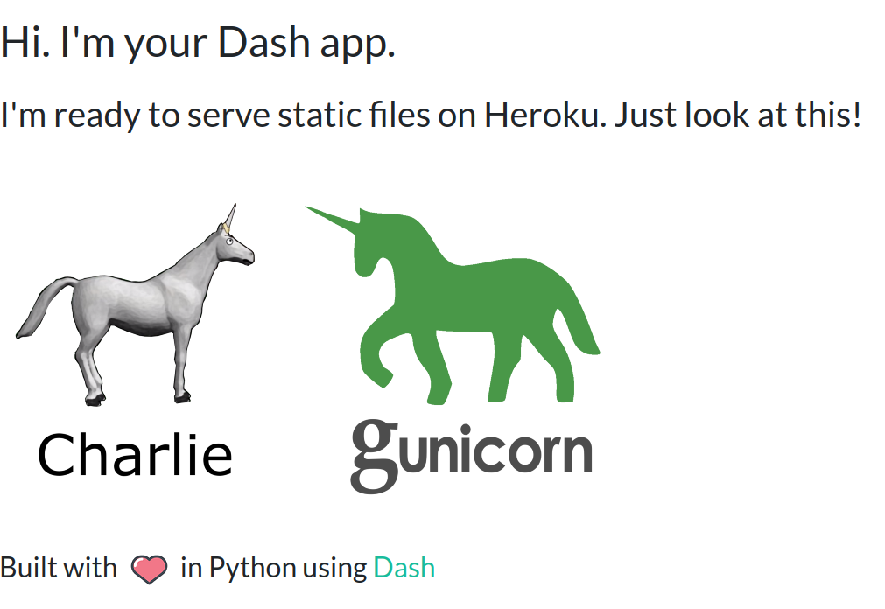

# dash-heroku
A running starter pack for deploying a Plotly Dash app on Heroku with support for hosting static files, such as images (a common pain point).
  

## Instructions

A full step-by-step guide is provided below to help you get your first Heroku app live. 
If you are a first-timer on Heroku, I suggest you get this starter app running on Heroku first, then you can adapt it to suite by copy-paste your Dash app code across etc. 
Heroku also has a concise guide for [getting started on Python](https://devcenter.heroku.com/articles/getting-started-with-python) which is a useful reference
  

## 1. Clone this repo to your local machine and install modules

It's a good idea to check you can get this app running on your local webserver before attempting to deploy on Heroku. So let's do that.
Setup your virtualenv (or don't) and ensure you have all the modules installed before running the app.

You should be able to do this with pip3 or conda install from a terminal in your project root folder

`pip3 install -r requirements.txt`  
`conda install --file requirements.txt` (if you are using Anaconda)
  

## 2. Test the app locally

Run the app from your IDE direct, or like a boss from the terminal: `python3 app.py`

If it runs, it should be visible on a browser via `https://0.0.0.0:8050`
  

## 3. Setup Heroku command-line-interface (CLI)

Depending on your OS, you may also need to install Git. Follow the general Heroku CLI [installation guide](https://devcenter.heroku.com/articles/heroku-cli). 
  

## 4. Create a Heroku account

You will also need a Heroku account (free tier is fine for a hobby app). Sign up [here](https://signup.heroku.com/login).
  

## 5. Login to Heroku via CLI

From your terminal window, login to Heroku CLI. This will open a browser window and you will need to login to your new Heroku account. 
Once done, return to your terminal and it should say 'Logged in as .... blah' (GOOD)

`heroku login`

## 6. Create a Heroku app linked to your Dash app

Now we must create a Heroku app that will magically link to your Dash app. ENSURE YOU ARE IN YOUR DASH PROJECT ROOT FOLDER IN A TERMINAL. Heroku docs on this step [here](https://devcenter.heroku.com/articles/getting-started-with-python#deploy-the-app).

`heroku create`

## 7. Deploy your app on Heroku

We are ready for the magic to begin. We will now do a Git push command to your remote Heroku app repository (which lives behind the scenes) and this will trigger a build of your Heroku app!

`git push heroku main`

You should begin to see a bunch of console output in the terminal as Heroku deploys your app. It should work fine on this repo, but as you add your own code in, be readoy to watch for errors. 

## 8. View your running public app in a browser!

If the build succeeds, you will be given a URL at the end that might look something like `https://fierce-reaches-07036.herokuapp.com/` (not a live url). 
Copy paste the URL from your console output into a browser, and with a few shakes of fairy dust, your app should be live :)
  

# Important Notes

**Sometimes you may need to create a new Heroku app**  
If you make major changes to file structure in your project, you may need to create a new Heroku app with `heroku create` and then `git push heroku main`. This can be annoying but it's only one extra step. I found that once my file structure was stable, if I was just changing code within an existing file, to deploy a new version just ensure you update your remote repo on github i.e. `git push origin main` FIRST. When your remote repo is fully up to date with the latest changes, then you can redeploy to Heroku really easily with a simple `git push heroku main`

**Heroku sometimes might not support the latest python modules**  
Just be aware that you may not be able to use the very latest packages. I think Heroku has to add special support for this so their packages can sometimes trail the latest ones you may be running on your local machine. You will see errors if this happens though so it will be obvious when you try to build and deploy. Just watch the console.

**If your build succeeds but you get 'APPLICATION ERROR' in the Browser**  
This is highly annoying, but it means something when wrong after the build, when the Gunicorn webserver tried to bring up your app. To view what is going on, you can see build logs in the Heroku web dashboard (by logging in), or the most easy way is to view the log tail from the console:

`heroku logs --tail`

